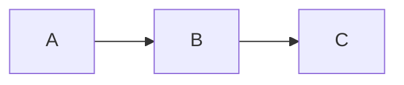
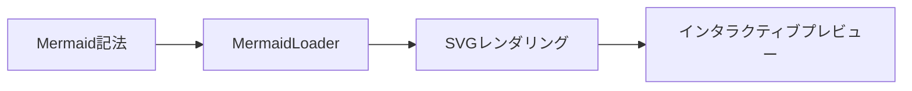
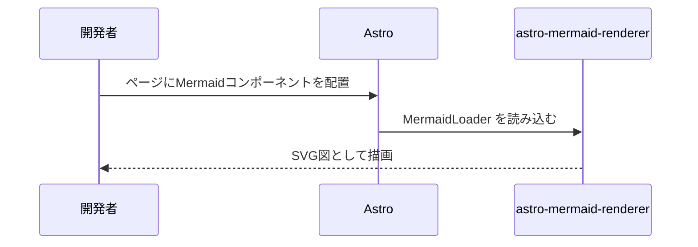

import MermaidLoader from "../components/MermaidLoader.astro";

# astro-mermaid-renderer

Mermaid記法をAstroコンポーネントとしてシンプルに統合。
クリックでズーム・パン可能なプレビューモーダルも標準搭載。

[Debug ページを開く →](/debug)

---

## 使い方

MDXファイル内でコードフェンスを使ってそのまま書けます。

````md

````

---

## サンプル図

### Flowchart



### Sequence Diagram



---

## 機能

- **SVGレンダリング** — Mermaid記法をブラウザ上でSVGへ変換
- **プレビューモーダル** — 図をクリックするとズーム・パン対応のモーダルが開く
- **コードフェンス記法対応** — ` ```mermaid ` をそのまま記述可能
- **タッチ操作対応** — ピンチズームやドラッグをモバイルでも利用可能

<MermaidLoader />
